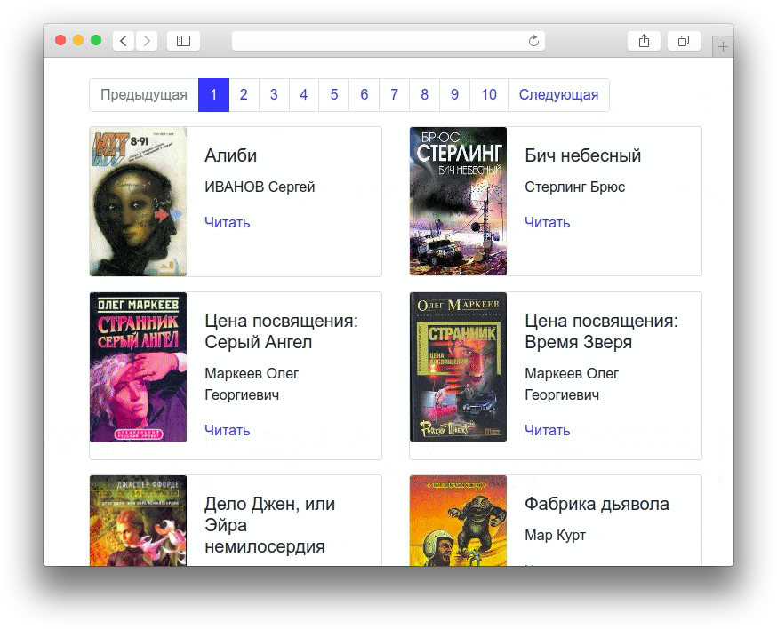
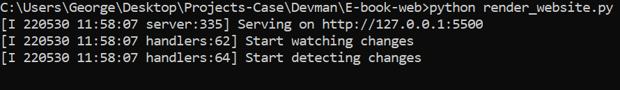

# Онлайн-библиотека SFBook

Программа загружает предустановленные книги из папки books/, картинки к ним из папки images/ на [сайт](https://george-salt.github.io/SFBook/) в файле [render_website](https://github.com/George-Salt/SFBook/blob/main/render_website.py).



## Установка

Сделайте fork [репозитория с библиотекой](https://github.com/George-Salt/SFBook/) и сохраните себе на компьютер.
Python3 должен быть уже установлен. Если вас его нет, то следуйте рекомендациям [статьи по установке Python для Windows](https://docs.microsoft.com/ru-ru/windows/python/beginners#install-python).
Затем используйте `pip` (или `pip3`, есть конфликт с Python2) для установки зависимостей:

```python
pip install -r requirements.txt
```

## Запуск

Для запуска программы используйте команду в папке проекта:

```python
python render_website.py
```

Вы увидите сообщение из консоли, что сайт запущен и готов к работе.



Протестировать запущенный сайт можно на сайте [127.0.0.1:5500](http://127.0.0.1:5500/).

## Цель проекта

Код написан в образовательных целях на онлайн-курсе для веб-разработчиков [dvmn.org](https://dvmn.org/).

## Использованные материалы

[Фавикон "Книга"](https://icons8.com/icon/119436/книга) взят с сайта [ICONS8](https://icons8.com/).
